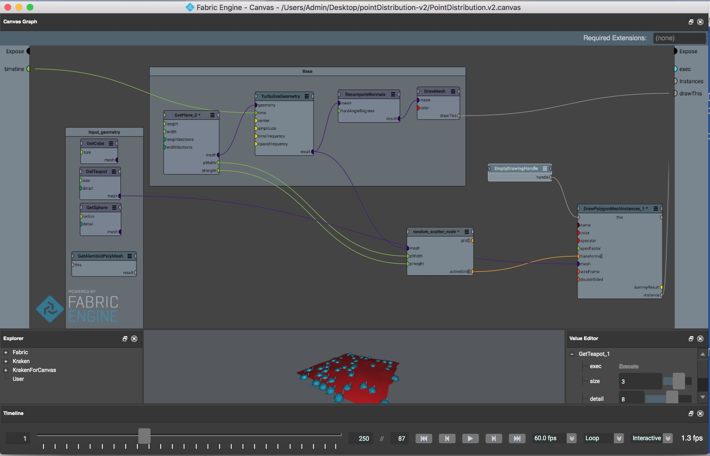

# fabric-pointDistribution
FabricEngine KL (Point distribution sample)
Poisson-disc sampling reference algorithm


## Existing Problem

The dart-throwing sampling algorithms are important in computer graphics industry. However, existing efficient techniques do not easily generalize beyond two dimensions. Here I demonstrate a simple modification to dart throwing which permits generation of Poisson disk samples in O(N) time, easily implemented in 3 dimension.

## Introduction

Most of the sampling algorithms are concentrated only on r distance to plot the point. But here I plotted a point between (r, 2r), such a way that calculate the random vector. Moreover, all the existing algorithms are concentrated only on 2-dimensions. In this algorithm, I concentrated on 3-dimensional, that is guaranteed to take O(N) time to generate N Poisson disk samples. The same algorithm will work for multiple dimensions as well.

As an additional step, if we are not able to find the relevant point in the random vector, pick the random point again from the standard grid which has all possible points as vertices.

## Algorithm

The algorithm takes the following inputs.
Define r : Minimum distance between samples
Define k : Limited iteration to choose before rejection (try k iteration, if not done, quit) 
Define n : Dimensional grid ( here, 3 dimensional)
Define w : cell size

## Step 1. Initialize an n-dimensional background grid for storing samples and accelerating spatial searches. We pick the cell size to be bounded by r/√ n, so that each grid cell will contain at most one sample, and thus the grid can be implemented as a simple n dimensional array of integers: the default resizing the grid with twice the total number of vertices indicates no sample, a non-negative integer gives the index of the sample located in a cell. 

## Step 2. Select the initial sample, x0, randomly chosen uniformly from the domain. Insert it into the background grid, and initialize the “active grid” (an array of sample indices) with this index (zero). 

## Step 3. While the active list is not empty, choose a random index from it (say i). Generate up to k points chosen uniformly from the spherical annulus between radius r and 2r around xi. For each point in turn, check if it is within distance r of existing samples (using the background grid to only test nearby samples). If a point is adequately far from existing samples, emit it as the next sample and add it to the active list. If after k attempts no such point is found, get again a random point from the vertices.


## Analysis

To implement the algorithm, I used Fabric Engine 2.5. I created a plane with turbulize geometry and connect this node with time line. So, whenever the timeline changes, the algorithm starts fresh computing.


The input node can be any valid geometry. For example, I used teapot geometry. However, you can use any geometry or any node that supports Fabric Engine for example, Alembic node, FBX File, … So instead of distrusting the points on the plane we can distribute the geometry on the plane. This approach will be useful in future if you want to extend the functionality of this algorithm.

In Fabric Engine, everything is Node. You can create your custom node and/or you can create/edit ports within nodes. The input and output ports should be predefined before you use it inside the node. Xfo is the transform node, here I used it as output port to get all the positions of the geometry.


In big picture, the canvas graph is the heart of Fabric Engine which will give pictorial view for the whole system. In the following canvas-graph I connected the plane geometry with turbulize and input teapot geometry is connected with scatter node which will compute all the positions with reference with algorithm and the resultant transform (Xfo) will be connected to drawing handle. So that users can view the geometry in the viewport.


Now, coming to the algorithm part, firstly pick the random position from the existing grid. The random point picking is achieved by “parallel execution(PEX)” procedure.
```
function Vec3 getRandomPositionFromFixed(Vec3 allPoistions[]) {
  Size randomIndex;
  Size startIndex = 0;
  Size totalSize = allPoistions.size();
  
  GetRandomIndex<<<totalSize>>>(startIndex,startIndex);  
  GetRandomIndex<<<totalSize>>>(startIndex,randomIndex);
 
  return allPoistions[randomIndex];

}
```

We need to draw the picked position as well as we need to store it in the activeGrid. Once it is done, we need to find the nearest point to the current point using +1/-1 distance for all the directions i.e, (x+1, y+1), (x-1, y-1), (x+1, y-1), (x-1, y+1). If we can find the nearest point and if the index is existing the grid then plot that point else we need to iterate the same process for 30 times, if we are not able to find the point then pick the random point from the grid and do the same approach.
```
Vec3 nearestPoint;
            Xfo neighbor;
            for(Integer iter=0; iter<k; iter++) {
              // Find nearest point
              Integer i, j;
              for(i=-1; i<=1; i++) {
                for(j=-1; j<=1; j++) {
                    nearestPoint.set((currPos.x+randomVector.x+i), (currPos.y + randomVector.y+j), 0);
                    Size index = (currPos.x+randomVector.x+i) + (currPos.y + randomVector.y+j) * cols;
                    if (index > grid.size()) continue;
                        neighbor = grid[index];
                         foundIndex = index; 
                        if (nearestPoint.distanceTo(currPos) < 1 || nearestPoint.distanceTo(currPos) < r) {
                            //reject it
                            foundNearest = false;
                        } // foundNearest
                   } // j loop end
                } // i loop end
              } // 30 times iterations
              
```
The output of the implemented algorithm is shown in the picture. 


## Acknowledgements
	The Algorithm reference has taken from Robert Bridson‘s paper.

## Canvas Graph

